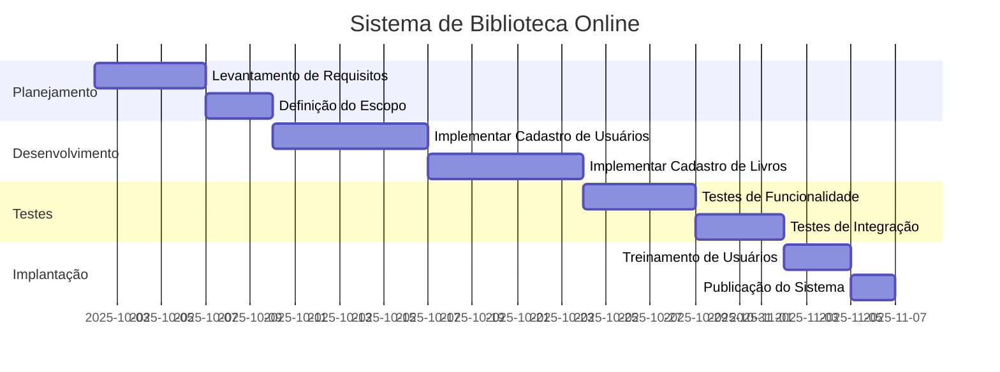

# Reposição atv
## Gráfico de Gantt – Sistema de Biblioteca Online

```mermaid
gantt
    title Sistema de Biblioteca Online
    dateFormat  YYYY-MM-DD
    
    section Planejamento
    Levantamento de Requisitos      :a1, 2025-10-02, 5d
    Definição do Escopo             :a2, after a1, 3d

    section Desenvolvimento
    Implementar Cadastro de Usuários :b1, after a2, 7d
    Implementar Cadastro de Livros   :b2, after b1, 7d

    section Testes
    Testes de Funcionalidade         :c1, after b2, 5d
    Testes de Integração             :c2, after c1, 4d

    section Implantação
    Treinamento de Usuários          :d1, after c2, 3d
    Publicação do Sistema            :d2, after d1, 2d
```
